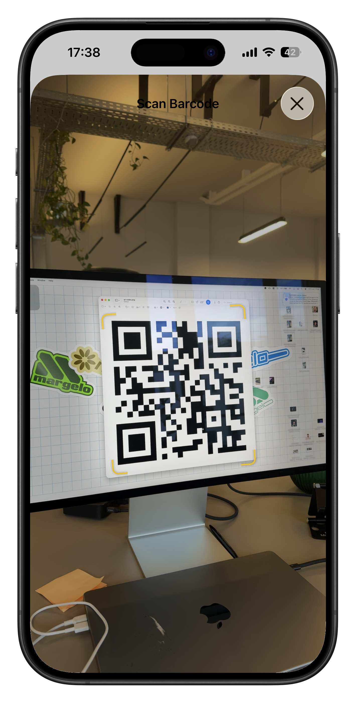
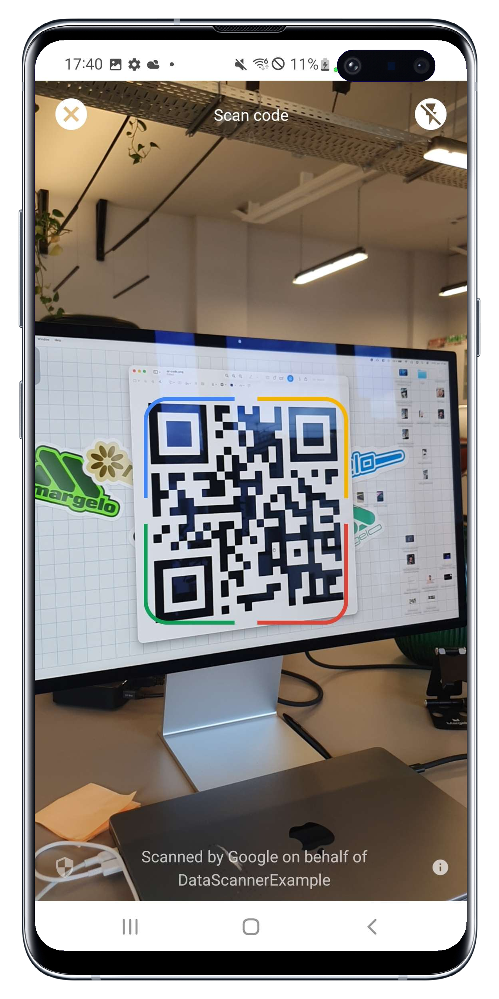

# react-native-data-scanner

Fast one-shot QR/Barcode scanning for React Native powered by [Nitro Modules](https://nitro.margelo.com) and platform-native scanner UIs.

- On Android, [Google's Code Scanner](https://developers.google.com/ml-kit/vision/barcode-scanning/code-scanner) scans QR/Barcodes via a Google Play Services Activity, which does not even require Camera Permission.
- On iOS, VisionKit scans QR/Barcodes via a platform-native [`DataScannerViewController`](https://developer.apple.com/documentation/visionkit/datascannerviewcontroller)

## Usage

### 1. Install the package

```sh
npm install react-native-data-scanner react-native-nitro-modules
```

### 2. Configure Camera Usage (iOS only)

#### A) Expo

If you use Expo, add `NSCameraUsageDescription` to your Expo app config:

```json
{
  "expo": {
    "ios": {
      "infoPlist": {
        "NSCameraUsageDescription": "Allow $(PRODUCT_NAME) to scan barcodes with the camera."
      }
    }
  }
}
```

This library contains native code, so Expo apps need a development build or production build. It does not run inside Expo Go. Rebuild the native app after changing native config, for example with `npx expo run:ios` or EAS Build.

#### B) Bare React Native

If you use bare react-native CLI instead, add `NSCameraUsageDescription` to your app's `Info.plist`:

```xml
<key>NSCameraUsageDescription</key>
<string>Scan barcodes.</string>
```

Android does not require additional setup.

### 3. Scan a barcode

```tsx
import { DataScanner } from 'react-native-data-scanner'

async function scanBarcode() {
  const barcode = await DataScanner.scanBarcode({
    targetFormats: ['qr', 'ean-13'],
    enableAutoZoom: true,
  })

  console.log(barcode.format, barcode.value)
}
```

That's it. Calling `scanBarcode(...)` presents the native scanner UI and resolves with the scanned barcode.

## UI Demo

<p align="center">
  
  
</p>

## API

### `DataScanner.scanBarcode(options?)`

Presents the scanner UI and resolves with the first barcode the user selects.

- `targetFormats`: optional non-empty array of barcode formats. Omit it to scan all supported formats.
- `qualityLevel`: quality/performance preference. Defaults to `'balanced'`.
- `enableHighFrameRateTracking`: high-frame-rate geometry tracking preference. Defaults to `false`.
- `enableAutoZoom`: automatic zoom preference for distant barcodes. Defaults to `false`.

The promise rejects when scanning is unavailable, the user cancels, another scan is already active, or the scanned barcode does not contain a decoded string value.

## Android

Uses Google ML Kit's Google code scanner through Google Play services. The library requests install-time download of the `barcode_ui` optional module through its Android manifest.
